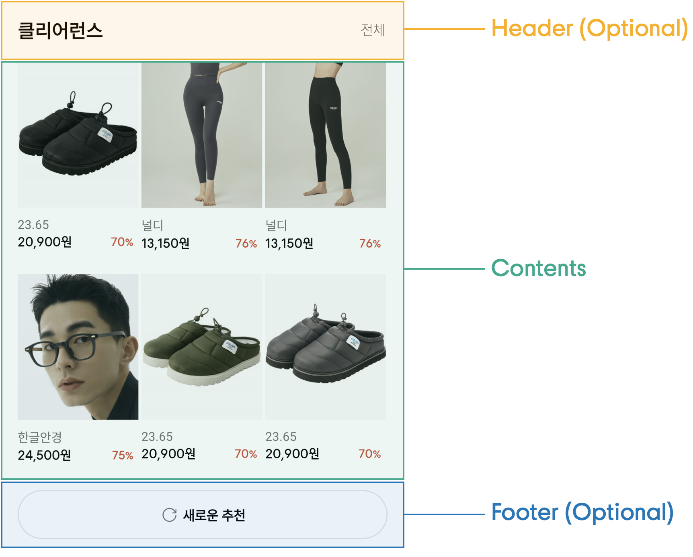
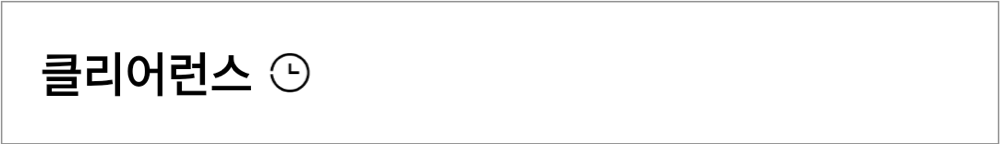
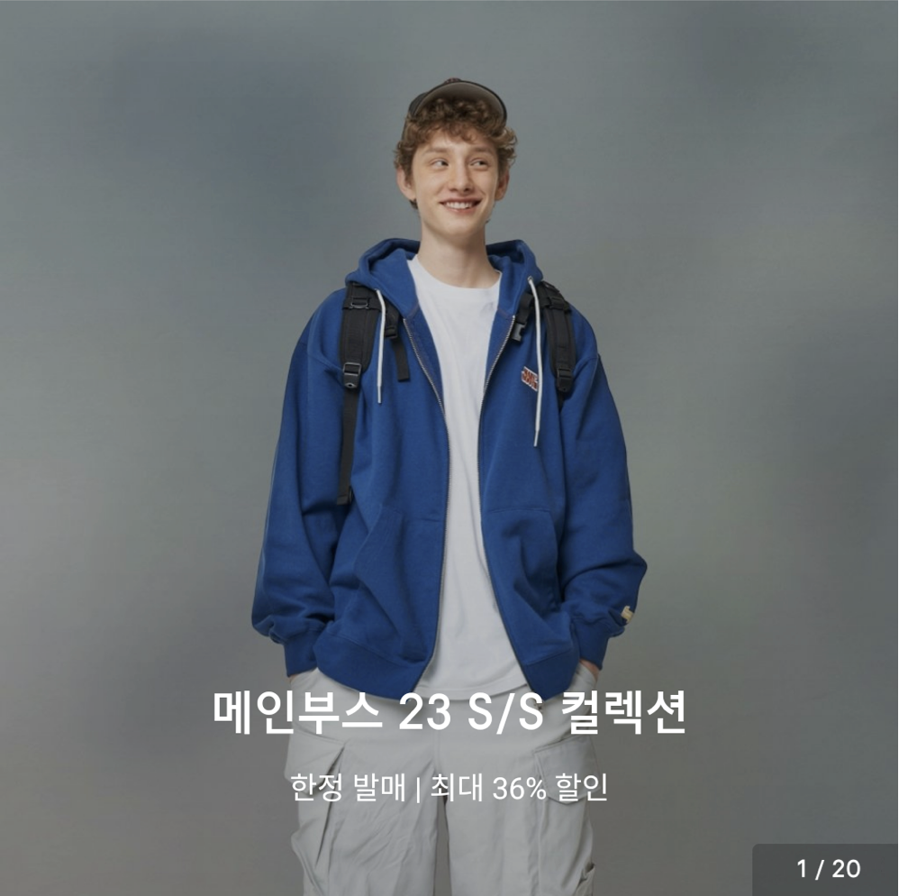
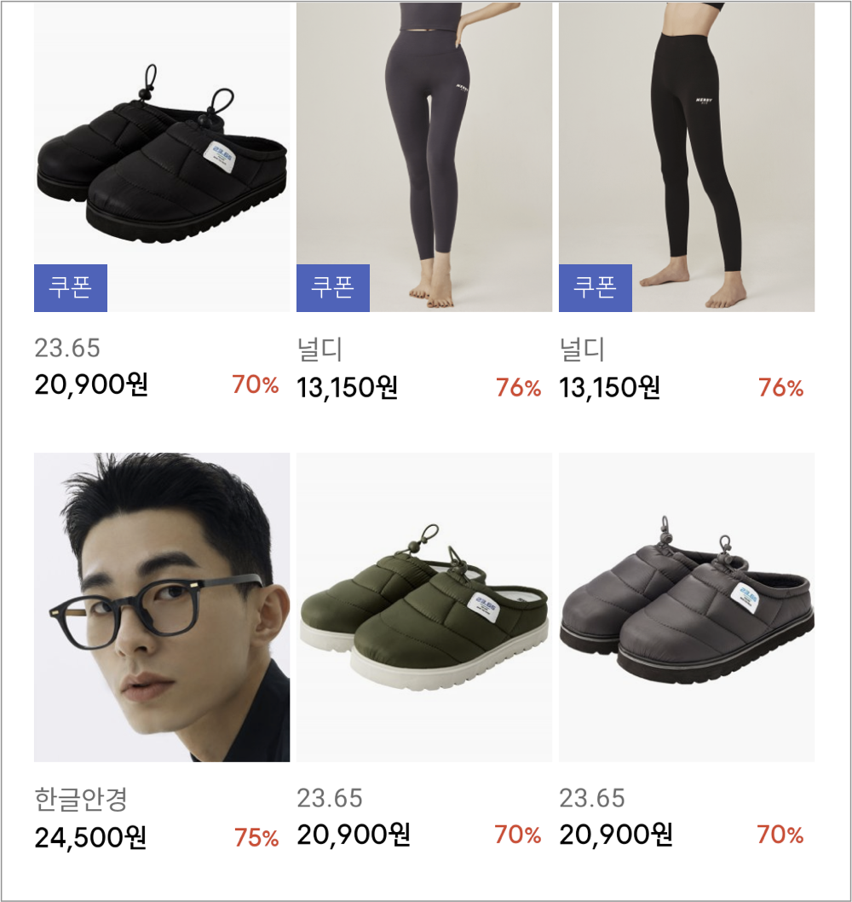
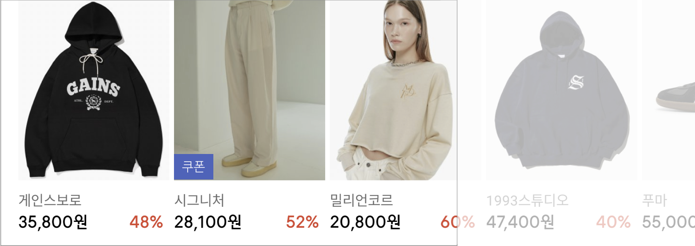
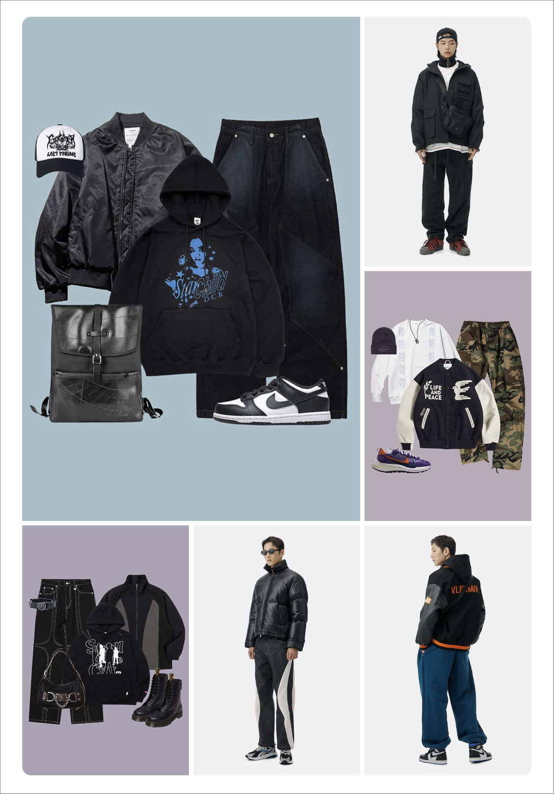
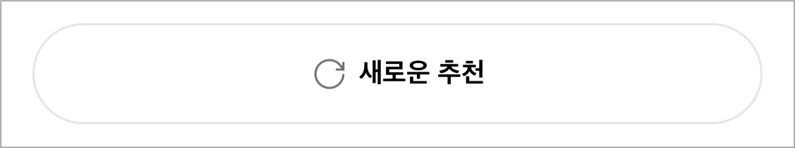
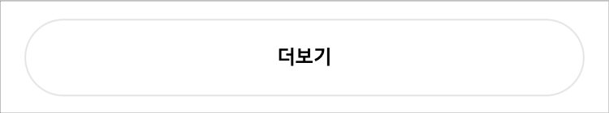

# 요구사항

---

## 기능 명세

- 유저가 **앱을 실행**하면 **다양한 콘텐츠**들(배너, 상품, 스타일 코디)을 볼 수 있어야합니다.
- 서버 **응답에 따라** 화면에 보여지는 **콘텐츠들의 순서와 형태가 달라져야합니다.**
- **디자인 시스템**을 구축하여 각 컴포넌트를 **재사용 및 조합하여 화면을 구성**해야합니다.

## 기술 명세

- **Kotlin** 으로 작성되어야 합니다.
- **MVVM 혹은 MVI** 디자인 패턴을 사용해야합니다.
    - (Optional) [**airbnb/mavericks](https://github.com/airbnb/mavericks)** 를 활용하여 **MVI** 로 구현해주세요
- **Jetpack Compose**를 사용해야합니다.
- 비동기 처리는 **Coroutine**을 사용해야합니다.
- (Optional) 단위 테스트 코드를 작성해 주세요.

## API 명세

- **JSON 데이터**를 기반으로 콘텐츠를 렌더링합니다.
- URL: https://meta.musinsa.com/interview/list.json
- **응답 구조**
    - **contents**
        - **banners**
            
            
            | linkURL | 배너를 선택했을 때 랜딩할 URL |
            | --- | --- |
            | thumbnailURL | 배너 이미지 URL |
            | title | 배너의 제목 |
            | description | 배너의 설명 |
            | keyword | 배너의 키워드 (Showcase) |
        - **goods**
            
            
            | linkURL | 상품을 선택했을 때 랜딩할 URL |
            | --- | --- |
            | thumbnailURL | 상품 이미지 URL |
            | brandName | 상품의 브랜드명 |
            | price | 상품 가격 |
            | saleRate | 상품 할인율 |
            | hasCoupon | 쿠폰 노출 여부 |
        - **styles**
            
            
            | linkURL | 이미지를 선택했을 때 이동시킬 링크 |
            | --- | --- |
            | thumbnailURL | 이미지 URL |
    - **header**
        
        
        | title | Header의 제목 |
        | --- | --- |
        | iconURL | Header의 아이콘 이미지 URL |
        | linkURL | Header의 ‘전체’ 클릭 시 랜딩할 URL |
    - **footer**
        
        
        | title | Footer의 제목 |
        | --- | --- |
        | iconURL | Footer의 아이콘 이미지 URL |
        | type | Footer의 종류 |

## 디자인 시스템 명세

### Header 명세

- **`header.iconURL` , `header.linkURL`** 모두 없을 경우 왼쪽에 **타이틀**만 표시합니다.
- 👈 눌러서 이미지 보기
    
    
    

- **`header.linkURL`** 이 있는 경우 오른쪽에 **‘전체’ 버튼**을 표시합니다.
- 👈 눌러서 이미지 보기
    
    
    

- **`header.iconURL`** 이 있는 경우 **타이틀**과 **아이콘**을 함께 표시합니다.
- 👈 눌러서 이미지 보기
    
    
    

### Contents 명세

- **`contents.type`** 이 **`BANNER`** 인 경우 **콘텐츠**를 스와이프하여 다음 배너를 노출할 수 있도록 합니다.
    - 우측 하단에 페이징 인디케이터를 표시합니다.
    - (Optional) 배너가 **3초마다 자동으로 스와이프**되도록 구현합니다.
    - (Optional) 배너가 **Parallax 하게 스와이프**되도록 구현합니다.
- 👈 눌러서 이미지 보기
    
    
    

- **`contents.type`** 이 **`GRID`** 인 경우 **콘텐츠**를 **3×2 Grid 형태**로 표시합니다.
- 👈 눌러서 이미지 보기
    
    
    

- **`contents.type`** 이 **`SCROLL`** 인 경우 **콘텐츠**를 **횡스크롤 형태**로 표시합니다.
- 👈 눌러서 이미지 보기
    
    
    

- **`contents.type`** 이 **`STYLE`** 인 경우 **콘텐츠**를 첫 번째 아이템이 **2x2 Span된 3열 Grid 형태**로 표시합니다.
- 👈 눌러서 이미지 보기
    
    
    

### **Footer 명세**

- **`footer.type`** 이 **`REFRESH`** 인 경우 콘텐츠 ****순서를 **랜덤하게 바꾸어 갱신**합니다.
- 👈 눌러서 이미지 보기
    
    
    

- **`footer.type`** 이 **`MORE`** 인 경우 **현재 콘텐츠에 1행을 추가로 더 표시**합니다.
    - 더이상 표시할 데이터가 없는 경우 **Footer가 보이지 않아야합니다.**
- 👈 눌러서 이미지 보기
    
    
    

# 평가 기준

---

- ⚠️ 명시된 **요구사항이 모두 반영**되어야합니다. (Optional 항목 제외)
- 서비스에 대한 **이해** **및** **구현 완성도**
- **유저 관점**의 고민
- 요구 기술의 **숙련도**
- 코드 및 설계 **품질**
- (Optional) 테스트 코드 작성 능력

# 참고사항

---

- 위 **이미지들은 예시**입니다. **문서를 기반으로 자유롭게 UI 를 구성**해 주세요.
- 필요하신 라이브러리(ex. Retrofit, Coil, etc.)들을 자유롭게 사용하셔도 됩니다.
- 빌드하고 실행하기 위한 **README 파일을 작성**해 주세요.
- 궁금하신 사항이 있으시다면 언제든 이메일로 문의해주세요.

# 제출방식

---

- 과제는 Github 사용하여 제출 해주세요.
