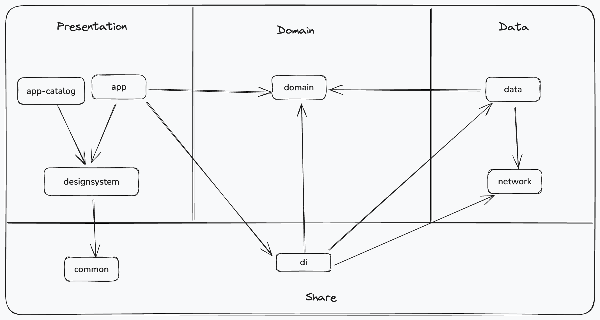

# 👨🏻‍💻 안드로이드 개발 👨🏻‍💻

## Project 환경 구성
- Android Studio Ladybug | 2024.2.1 Patch 2
- Java 11
- Gradle Local Java 21.0.3
- Android Gradle Plugin 8.7.2
- Kotlin 2.0.21

## 개요
- 📱 상품 전시 화면 만들기

## Libraries
- Jetpack Compose
- AndroidX
    - Core
    - ViewModel
- Material Design
- Kotlin
    - Coroutines
- Dagger Hilt
- Square
    - Retrofit, Okhttp
- Coil
- Timber Logging

## Architecture
- Clean Architecture + MVVM

<!--suppress CheckImageSize, HtmlRequiredAltAttribute -->


## Project Structure
```
root
|   
├── app                     // 앱 모듈 
|   
├── app-catalog             // 디자인 시스템 기반 카탈로그 앱(디자인 컴포넌트 확인용) 
|   
├── network                 // 네트워크, API 인터페이스
|   
├── di                      // 의존성 주입 모듈
|   
├── data                    // 데이터 모델, 레포지토리 구현, 데이터 소스
|   
├── domain                  // 도메인 모델, 도메인 유즈케이스, 레포지토리 인터페이스
|   
└── core ┐
         |
         ├── common         // 공통 모듈
         |
         └── designsystem   // 디자인 시스템 모듈
```

## 주요 기능
- 유저가 앱을 실행하면 다양한 콘텐츠들(배너, 상품, 스타일 코디)을 볼 수 있습니다.
